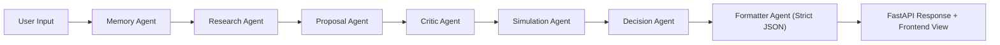

# Debate-Driven Autonomous AI Agent System
### From a single prompt to an auditable, impact-scored business decision in one autonomous run.

> **Hook:** This is not a chatbot response engine. It is a multi-agent decision workflow that debates, critiques, simulates outcomes, recovers from failures, and returns structured enterprise-ready JSON.

## Problem Statement
Enterprise teams make high-stakes decisions under uncertainty: cost optimization, growth strategy, risk mitigation, and resource allocation.  
Traditional assistants return one-shot text with limited reasoning traceability and weak business measurability.

This creates recurring enterprise pain:
- Inconsistent decision quality across teams
- Low explainability for leadership and operations
- Poor linkage between recommendations and measurable impact

## Solution Overview
This project, built for **ET AI Hackathon 2026**, implements an autonomous multi-agent system that turns raw prompts into structured decisions.

Instead of one model answer, specialized agents collaborate in sequence:
1. Generate options
2. Critique assumptions
3. Simulate impact
4. Produce final strategy with confidence and risk framing

Final output is strict JSON, designed for dashboards, APIs, and enterprise workflows.

## Key Highlights
- **Multi-agent reasoning:** Dedicated Research, Proposal, Critic, Simulation, and Decision agents
- **Autonomous execution:** End-to-end workflow runs without manual chaining
- **Structured decision output:** Consistent JSON with strategy, actions, risks, ROI, and confidence
- **Resilience by design:** Retry logic, model fallback, and graceful error recovery
- **Learning loop:** Memory module improves future runs from prior successful strategies

## System Architecture
The platform uses a stateful agent graph (LangGraph/custom workflow) where each node performs a distinct reasoning responsibility and passes structured state forward.

### Agent Roles
- `Memory Agent`: Loads prior successful strategies and confidence scores
- `Research Agent`: Builds concise domain context
- `Proposal Agent`: Produces candidate strategy actions
- `Critic Agent`: Challenges blind spots and failure modes
- `Simulation Agent`: Estimates ROI, risk level, and time-to-results
- `Decision Agent`: Synthesizes trade-offs into final recommendation
- `Formatter Agent`: Enforces strict JSON schema for downstream reliability

### State Flow (Technical)
`input -> memory -> research -> proposal -> critique -> simulation -> decision -> formatter -> output`

Each node reads/writes a shared state object (`data`, `proposal`, `critique`, `simulation`, `decision`, `final_output`) so the system remains composable, testable, and observable.



## Why Not a Chatbot?
| Capability | Typical Chatbot | Debate-Driven Multi-Agent System |
|---|---|---|
| Reasoning style | Single-pass response | Multi-step debate and synthesis |
| Quality control | Minimal self-checking | Explicit critic and simulation stages |
| Output format | Free-form text | Strict schema-driven JSON |
| Reliability | Fails hard on API errors | Retry + fallback + recovery paths |
| Enterprise fit | Hard to integrate | API-safe, auditable, and measurable |
| Continuous improvement | Stateless | Memory-informed future decisions |

## Features
- Autonomous, multi-agent execution pipeline from one input trigger
- Role-specialized reasoning for stronger decision quality
- Strict structured output for BI dashboards and API consumers
- Built-in rate-limit handling (`429`) with retries and fallback model switch
- Non-crashing recovery flow with safe fallback decisions
- Memory-backed adaptation from previous successful runs
- Frontend interface for fast prompt-to-result demonstrations
- Enterprise-oriented impact fields: ROI, risk, timeline, confidence

## Tech Stack
- **Backend:** FastAPI, Python
- **Orchestration:** LangGraph (or custom state graph workflow)
- **LLM Provider:** Groq API
- **Frontend:** HTML + JavaScript
- **State/Memory:** JSON memory store with dedupe + retention logic

## How It Works (Step-by-Step)
1. User submits a strategic prompt from UI.
2. Memory is loaded and injected into research/proposal prompts.
3. Research agent creates concise context.
4. Proposal agent generates strategy actions.
5. Critic agent stress-tests assumptions.
6. Simulation agent estimates expected impact.
7. Decision agent synthesizes final recommendation.
8. Formatter enforces strict JSON schema.
9. API returns structured output for frontend rendering.

## Real-World Use Case Demo
### Scenario: Reduce startup burn rate

**Input**  
`Reduce startup burn rate`

**Process**  
Research -> Proposal -> Critique -> Simulation -> Decision -> Structured Output

**Output**  
- 1-sentence strategy summary  
- 5 clear actions  
- 2 risks  
- ROI + risk level + implementation timeline  
- confidence score

**Business Impact**  
- Faster strategic decisions  
- Higher consistency across leadership reviews  
- Better visibility of trade-offs before execution

## Sample Output
```json
{
  "topic": "Reduce startup burn rate",
  "strategy_summary": "Reduce burn through focused cost control and stronger cash discipline.",
  "top_actions": [
    "Audit recurring spend and remove low ROI tools",
    "Renegotiate vendor contracts and improve payment terms",
    "Prioritize critical hires and pause nonessential recruitment",
    "Focus marketing only on highest converting channels",
    "Improve invoicing and accelerate customer collections cycle"
  ],
  "metrics": {
    "burn_rate": "Monthly net cash outflow",
    "runway": "Months of cash left",
    "cash_flow": "Net cash movement",
    "operating_expenses": "Total recurring costs"
  },
  "risk_notes": [
    "Avoid cutting essential growth investments",
    "Monitor team productivity impact"
  ],
  "expected_impact": {
    "roi": "20-30%",
    "risk_level": "Medium",
    "time_to_results": "1-3 months"
  },
  "confidence_score": 85
}
```

## Impact & Metrics
- **ROI Orientation:** Every run includes explicit impact estimation (`roi`)
- **Efficiency Gain:** Converts multi-step strategic analysis into one autonomous execution flow
- **Decision Quality:** Critique + simulation reduce one-sided recommendations
- **Operational Readiness:** Output is concise, structured, and directly actionable
- **Governance Support:** Confidence + risk notes improve executive review quality

## Autonomous Behavior
- **Retry Logic:** Retries failed LLM calls automatically
- **Rate-Limit Recovery:** Handles `429` gracefully without crashing the graph
- **Model Fallback:** Switches to backup model when primary model is constrained
- **Safe Defaults:** Returns valid structured fallback outputs under failure
- **Memory Learning:** Stores successful strategy summaries for future context injection

## ET AI Hackathon 2026 Alignment
### 1) Innovation
Debate-based agent collaboration replaces single-response assistant behavior.

### 2) Real-World Impact
Targets enterprise strategy workflows with measurable decision outputs.

### 3) Technical Implementation
Stateful multi-agent orchestration, schema-enforced formatter, memory, and resilient error handling.

### 4) Architecture Clarity
Clear role separation, explicit state transitions, and deterministic output contract.

### 5) Presentation Quality
Readable pipeline, structured demo flow, and judge-friendly measurable metrics.

## Setup Instructions
### 1. Clone and enter project
```bash
git clone <your-repo-url>
cd ai-agent-system
```

### 2. Create environment and install dependencies
```bash
python -m venv venv
# Windows
venv\Scripts\activate
# macOS/Linux
# source venv/bin/activate

pip install -r requirements.txt
```

### 3. Configure environment variables
Create `.env`:
```env
GROQ_API_KEY=your_api_key_here
```

### 4. Run backend API
```bash
uvicorn api.app:app --reload
```

### 5. Run frontend
- Open `index.html` in browser (or serve it via a static server)
- Enter a prompt and click **Run**

## Demo Instructions
1. Start FastAPI backend.
2. Open frontend UI.
3. Submit prompt: `Reduce startup burn rate`.
4. Walk judges through each agent stage in logs.
5. Show strict JSON output and impact fields.
6. Re-run to show memory-informed improvement.
7. Simulate API stress to demonstrate graceful fallback behavior.

## Future Improvements
- Multi-objective optimization across ROI, risk, and timeline
- Pluggable enterprise policy constraints and compliance checks
- Human-in-the-loop approval for high-risk recommendations
- Persistent vector memory + retrieval scoring
- Agent-level observability dashboard (latency, retries, fallback rates)

---
Built for **ET AI Hackathon 2026** to demonstrate autonomous, explainable, resilient, and enterprise-grade AI decision systems.
